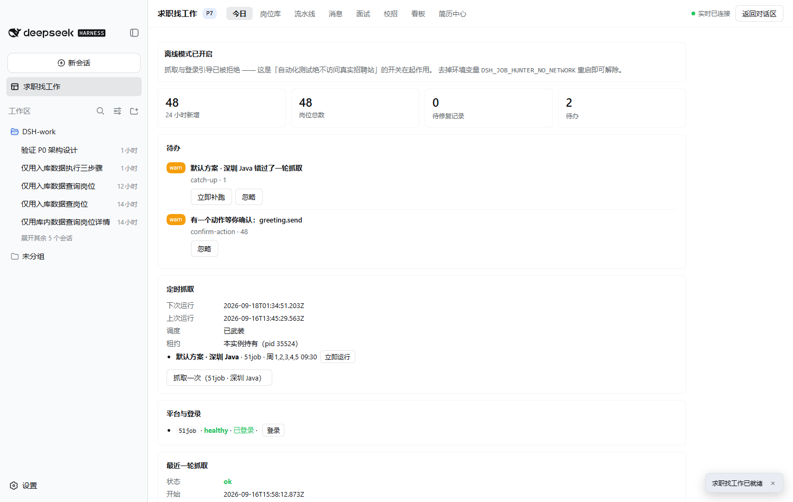
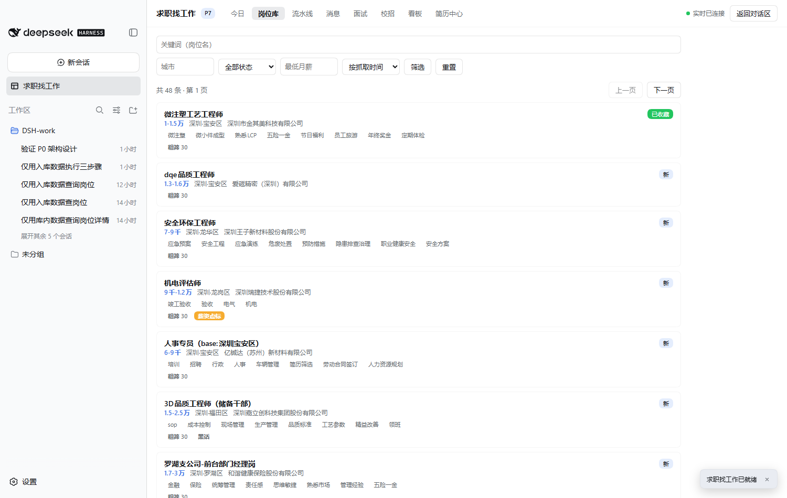
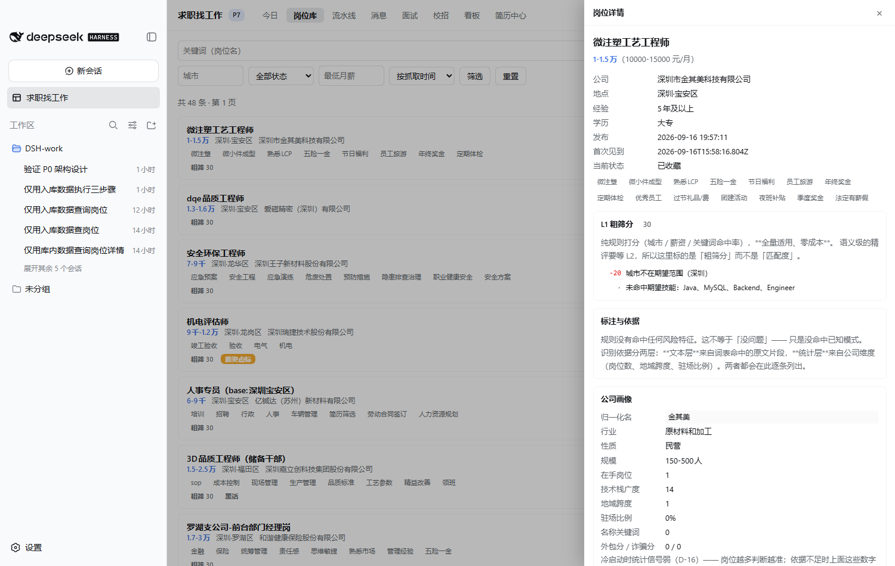
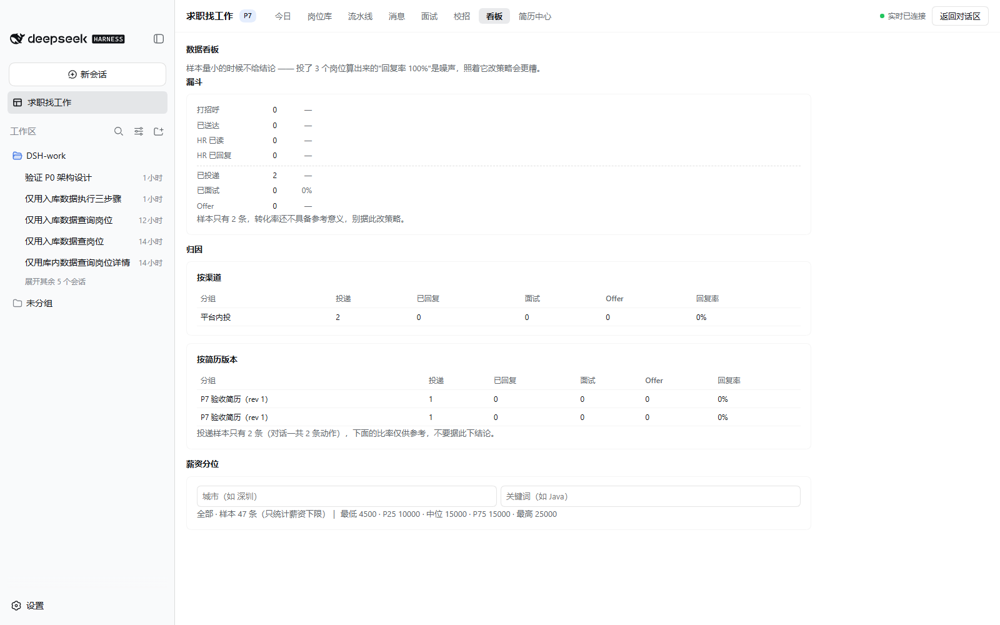
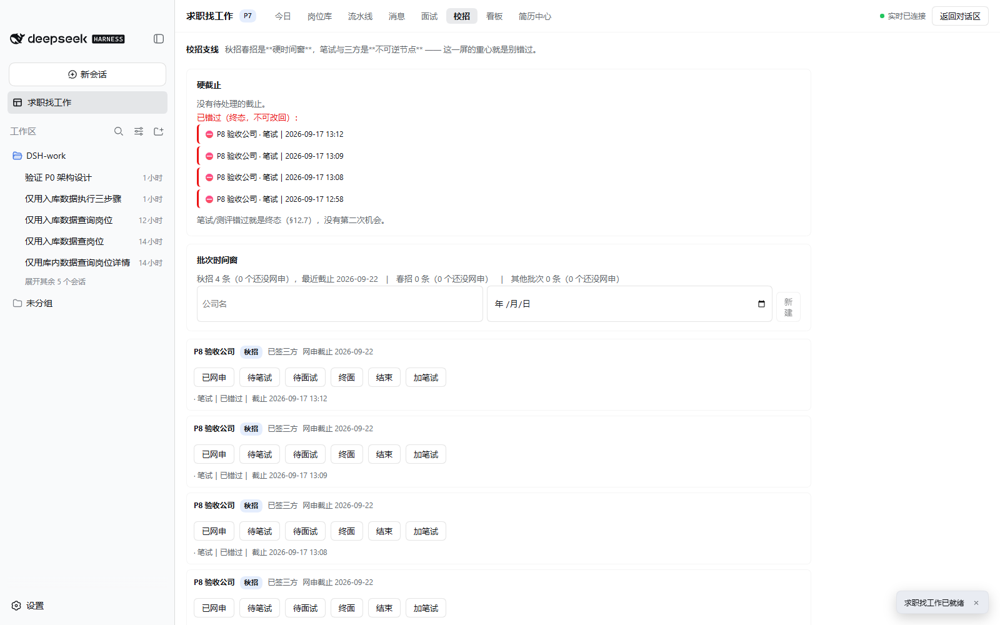

# 求职找工作（dsh-job-hunter）

> 一个跑在你自己电脑上的求职助手：把散在各个招聘网站的岗位收进同一个地方，帮你判断哪些值得花时间，
> 提醒你别错过截止日期，并记下每一次投递后来怎么样了。
>
> **数据只存在你的电脑上** —— 没有服务器、不上传、不联网同步。

它不替你决定投哪家，也不保证结果。它做的是让你**少翻十几个网页、少漏一次截止、少踩一个坑**。



## 它帮你做什么

| 你遇到的麻烦 | 它怎么帮 |
|---|---|
| 岗位散在好几个网站，每天重复翻 | 按你设的条件（城市、关键词）自动收进一个「岗位库」，每天打开就是新收到的 |
| 几百个岗位不知道先看哪个 | 自动打分排序，**并且说清分数是怎么来的**（哪条加了几分、哪条扣了分） |
| 分不清外包、诈骗、常年挂着不招人的岗位 | 按岗位描述里的措辞标出来（外包 / 高薪无门槛 / 僵尸岗 / 薪资虚标），每条标注都附上原文依据 |
| 想打招呼但不知道说什么 | 按岗位和你的简历生成一段话术，可以复制去发 |
| 投出去就忘了，HR 不回也不知道在等谁 | 每个岗位的进展都有记录：投没投、HR 读没读、约没约面、卡在哪一步几天了 |
| 面试撞时间、时区算错 | 自动查撞车；面试前给一份准备包（技能差距、公司风险、通勤或视频建议） |
| 校招的笔试、网申、三方截止错过就没了 | 把这几类硬截止单独拎出来按到期时间提醒 |
| 简历一岗一改太累，投了哪版也记不清 | 简历分版本管理；按岗位给定制建议（**你确认后才采用**）并记下"这版投了哪个岗"；可导出 PDF / Word |
| 海外岗位看不出提不提供工签 | 从描述里识别工签与远程情况；**识别不出来就直说"没写"，不猜** |

## 界面一览

八个标签，从左到右基本就是每天的用法：

| 今日 | 岗位库 |
|---|---|
|  |  |

| 岗位详情与简历定制 | 数据看板 |
|---|---|
|  |  |

| 校招支线 | |
|---|---|
|  | |

另外三个标签是**流水线**（投递走到哪一步了）、**消息**（HR 来信与回复）、**面试**。
截图取自开发时的实际运行，界面就是这个样子。

## 怎么开始用

**前提**：装了 DSH 桌面端（0.1.5 以上），机器上有 Node 24 和 `pnpm`。

1. **装**。在终端里跑一条命令，把它装进你自己的配置：

   ```bash
   dsh plugin --profile web add github:KrisDong-developer/job-hunter
   ```

   装完**重启一次 DSH**，侧栏就会出现「求职找工作」。

2. **登录你自己的招聘网站账号**。在面板里点「登录」，用你自己的浏览器登录一次，之后采集就用这个登录态。
   **账号密码始终在你自己的浏览器里** —— 它没有存过，也不需要你交出来。

3. **设一个搜索条件，然后每天看一眼「今日」。** 它默认会在你设定的时间（默认是工作日早上，
   HR 比较活跃的时段）自动跑一次；**错过了不会背着你猛跑**，而是弹一个待办问你要不要补。

## 先把边界说清楚

下面这些是**现在真的没有**的，别按期望猜：

- **目前只接通了「前程无忧（51job）」一个平台。** BOSS 直聘、猎聘实测有风控拦截；
  牛客、实习僧（校招）**没有写适配，用不了**；Indeed 中国站已停运（适配器默认 disabled）、
  LinkedIn 领英已接入（calibrated，主通道为 guest 匿名端点）。
- **「一键发送打招呼」只在 BOSS 直聘（zhipin）上有。** 其它平台的适配器**刻意没有接**这个动作
  （平台自身没有稳定的"发起聊天"入口契约），所以在「岗位库」勾一批去打批量招呼时，
  界面会**逐条**告诉你哪条能发、哪条为什么发不了（发不了的不花模型调用生成话术）——
  不会点下去才失败，更不会假装发送成功。前程无忧等平台仍然只能生成话术、自己复制过去发。
- **不做机器翻译。** 英文简历只做体检（年龄、照片、婚姻这类不该出现的项，以及职责式开头）；
  需要英文简历请自己写。机翻简历是明确不做的功能。
- **不绕过验证码、不做指纹伪造、不用代理池。** 环境一致性手段（patchright 引擎 / stealth 注入 / 端口守卫）是刻意的边界：让真实浏览器在自动化时和手动时一样"干净"，不伪装身份。
- **批量投递（L4）默认关闭**，属"账号风险自担"的开关。打开之后，「岗位库」勾几条可以「批量投递」，
  单条在岗位详情里也能投。但**投出去撤不回来**：所以一次最多 5 条、每条之间等 3–9 秒，
  而且**每一批都要你点一次确认**。它会先做一次只读预览，逐条告诉你哪条能投、哪条为什么不能
  —— **目前只有 BOSS 直聘与智联招聘的适配器接了投递动作**，其余平台会如实说"没接"，不会假装成功。
  投递时**平台上收到的**是平台自己那份简历（平台没有把本地文件发给 HR 的入口，我们改不了它）；
  你可以在提交前选"这次投递算用了哪一版简历" —— 这一格**只作本地记录**（用来看哪版回复率高），
  界面会把"这份文件不会上传"明确写出来，不会让你以为传了。要换平台上那份，得先去平台上换。
  另：BOSS 的「发简历」要**双方回复之后**才可用，所以那边常见的结果是"投不出去"，理由是平台侧给的。
- **没有云端、没有手机 App、没有多设备同步。** 换电脑要自己搬数据。
- **不保证结果。** 它是个整理与提醒工具，不是求职中介。

## 你的数据在哪里

- 全部在你电脑上的这个文件夹里：DSH 数据目录下的 `job-hunter/`（一个本地数据库 + 你导出的简历文件）。
- 没有服务器，不上传，不联网同步。**卸载插件不会自动删数据**，要清理就自己删这个文件夹。
- 想留底或换电脑，在「设置 → 数据与存储」里可以直接导出：**JSON 是全量备份**（认准它）、
  CSV 是给 Excel 看的（带 BOM，打开不乱码）、归档还带上简历附件的原文件。
- 那一页也能看到**到底占了多少空间**，并且**清理前会先给你看要删什么**：
  投递记录、打招呼、消息、面试、简历与附件都**不在清理范围内**，只能由你自己删。
- 用模型生成话术或定制简历时，只发送必要的字段；手机号、邮箱、身份证、银行卡这类会先被剥掉，
  而且**每次外发用了哪些字段都留了记录，你可以自己查**。
- 简历正文默认**不**发给模型，需要你在设置里自己打开。
- 界面里的"危险动作"（投递、回复 HR 等）都要你**点一次确认**才执行；模型自己发起的动作同样要你确认，
  并且模型不能替自己按那个确认。

## 免责声明

**本项目仅供学习与技术研究使用。** 采集要遵守目标网站的服务条款与当地法律；自动发送有账号风险；
模型生成的内容必须你自己复核后再用。完整条款见 [`DISCLAIMER.md`](DISCLAIMER.md)。

## 许可

[MIT](LICENSE) —— 可以自由使用、修改、分发。

> 需要提醒一句：MIT **在法律上是允许商业使用的**，所以仓库里写的「仅供学习」是作者的立场与建议，
> 不构成许可限制。要强制禁止商用就得换成非开源的自定义许可。

## 给开发者

实现细节、每个阶段的验收证据、以及**十六个实测踩过的坑**都在 → [`README.dev.md`](README.dev.md)。
设计文档是 `ARCHITECTURE.md` 与 `REQUIREMENTS.md`；适配器坏了怎么修在 `docs/ADAPTERS.md`。

技术栈一句话：DSH 插件（宿主半 + 浏览器界面半），用 Node.js 内置 sqlite 存数据，用 Playwright
复用你自己的浏览器登录态采集。**485 个离线测试**，`npm test` 一条命令跑完，
测试绝不访问真实招聘网站。
